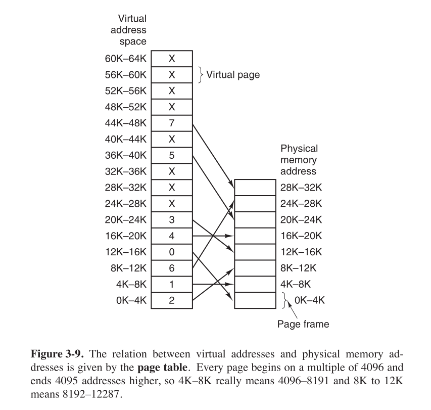

## 无存储器抽象

* 早期计算机没有存储器抽象，每个程序都直接访问物理内存

```asm
MOV REGISTER1, 1000  ;将位置1000的物理内存中的内容移到 REGISTER1 中
```

* 因此那时呈现给程序员的存储器模型就是简单的物理内存：从 0 到某个上限的地址集合，每个地址对应一个可容纳一定数目（通常是 8 个）二进制位的存储单元
* 这种情况下，在内存中同时运行两个程序是不可能的，如果一个程序在 2000 的位置写入一个新值，就会擦掉另一个程序在相同位置上的内容，因此无法同时运行两个程序，这两个程序会立刻崩溃
* 为了运行多个程序，一个解决方法是，操作系统把当前内存中所有内容保存到磁盘，然后把下一个程序读入到内存中再运行即可。同一时刻，只要内存中只有一个程序，就不会发生冲突
* 但这种方法有一个重要的缺陷，即重定位（即逻辑地址到物理地址的转换）问题。假设有两个程序，第一个程序在 0 处的指令是 `JMP 24`，第二个程序在 0 处的指令是 `JMP 28`，当第一个程序运行一段时间后再运行第二个程序，第二个程序会跳到第一个程序 28 处的指令。由于对内存地址的不正确访问，程序立刻崩溃
* 一个补救方法是静态重定位，即装入时将逻辑地址转换为物理地址。当一个程序被装载到地址 16384 时，常数 16384 被加到每一个程序地址上。虽然这个机制在不出错误的情况下可行，但不是一种通用的解决方法，同时会减慢装载速度，并且它要求所有的可执行程序提供额外的信息，以区分哪些内存字中存有可重定位的地址，哪些没有
* 虽然直接引用物理地址对大型计算机、小型计算机、台式计算机、笔记本都已经成为了历史，但在嵌入式系统、智能卡系统中，缺少存储器抽象的情况仍然很常见。像收音机、洗衣机、微波炉都是采用访问绝对内存地址的寻址方式，其中的程序都是事先确定的，用户不能在其上运行自己的软件，因此它们可以正常工作
* 总之，把物理地址暴露给进程带来的严重问题有：
  * 如果用户程序可以寻址内存的每个字节，就可以轻易破坏操作系统
  * 想要运行多个程序很困难

## 一种存储器抽象：地址空间

* 要使多个程序同时存在于内存中并且互不影响，需要解决保护（进程只能访问自己的内存）和重定位两个问题。对前者的一个原始的解决方法是，给内存标记上一个保护键，并且比较执行进程的键和其访问的每个内存字的保护键，比如进程能访问的空间是 0-100，CPU 标记此范围，然后在访问内存时检查是否为该进程可访问空间。不过这种方法并没有解决重定位问题
* 更好的方法是创造一个新的存储器抽象：地址空间。地址空间是一个进程可用于寻址内存的一套地址集合，每个进程都有一个自己的地址空间，并且这个地址空间独立于其他进程的地址空间（除了一些情况下进程需要共享地址空间）
* 地址空间的概念非常通用，比如 7 位数字的电话号码的地址空间是 `0 000 000` 到 `9 999 999`，x86 的 I/O 端口的地址空间是 `0` 到 `16383`，IPv4 的地址空间是 `0` 到 `2 ^ 32 - 1`。地址空间也可以是非数字的，比如以 `.com` 结尾的网络域名的集合
* 比较难的是给每个程序一个独有的地址空间，使得两个程序的相同地址（如地址 28）对应不同的物理地址
* 一个简单的方法是使用动态重定位，即运行时将逻辑地址转换为物理地址。把每个进程的地址空间映射到物理内存的不同部分，当一个进程运行时，程序的起始物理地址装载到基址寄存器（又称重定位寄存器），程序的长度装载到界限寄存器（又称限长寄存器）。进程访问内存，CPU 在把地址发送到内存总线前会自动把基址加到进程发出的地址值上，同时检查程序提供的地址是否超出了界限寄存器中的值，如果超出了就会产生错误并终止访问。对于之前的例子，比如第二个程序的 `JMP 28`，CPU 会将其解释为 `JMP 16412`
* 使用基址寄存器和界限寄存器重定位的缺点是，每次访问内存都需要进行加法和比较运算，比较运算可以很快，但加法运算由于进位传递时间的问题，在没有使用特殊电路的情况下会显得很慢
* 但物理内存是有限的，把所有进程一直保存在内存中需要巨大的内存，内存不足就无法支持这点。处理内存超载有两种通用方法，最简单的是交换（swapping）技术，即把进程完整调入内存运行一段时间，然后把它存回磁盘，这样空闲进程主要存储在磁盘上，不运行就不会占用内存。另一种方法是虚拟内存（virtual memory），它能使程序只有一部分调入内存的情况下运行
* 交换可能在内存中产生多个空闲区（hole）。把进程尽可能靠近，将这些小的间隙合并成一大块，这种技术称为内存紧缩（memory compaction）。通常不进行这个操作，因为它需要耗费大量 CPU 时间
* 如果进程的数据段可以增长（比如从堆中动态分配内存），进程与空闲区相邻，则可以把空闲区分配给进程使其增大。如果进程之间紧紧相邻，就需要把要增长的进程移到内存中一个足够大的区域，或者把一个或多个进程交换出去以生成足够大的空闲区。如果进程在内存中不能增长，并且磁盘上的交换区已满，则这个进程只能挂起直到有空间空闲，或者结束
* 如果大部分进程在运行时需要增长，为了减少因内存区不够而引起的进程交换和移动开销，一种方法是在换入或移动进程时额外分配一些预留内存
* 动态分配内存时，操作系统必须对其进行管理，一般跟踪内存使用情况有两种方法：位图和空闲区链表
* 使用位图法时，把内存划分成分配单元（每个单元小到几个字节或大到几千字节），用位图中的一位来记录每个分配单元的使用情况，比如 0 表示空闲 1 表示占用（或者相反）。分配单元越小，位图越大，不过即使 4 个字节大小的分配单元，32 位的内存只需要 1 位位图，位图只占用了 `1 / 32` 的内存
* 位图法的主要问题是，在决定把一个占 `k` 个分配单元的进程调入内存时，存储管理器必须搜索位图，在位图中找出有 `k` 个连续 0 的串，这个查找操作很耗时，因为在位图中该串可能跨越字的边界
* 另一个记录内存使用情况的方法是，维护一个记录已分配内存段和空闲内存段的链表，链表中的一个节点包含一个进程或者两个进程间的一块空闲区
* 使用链表法时，为进程分配内存的最简单的算法是首次适配（first fit）算法，存储管理器沿链表搜索，直到找到一个足够大的空闲区，然后将空闲区分为两部分，一部分为要分配的大小，供进程使用，另一部分形成新的空闲区
* 对首次适配算法进行小修改可以得到下次适配（next fit）算法，区别是在每次找到合适的空闲区时记录位置，这样下次就可以从上次结束的地方开始搜索。Bays 的仿真程序证明下次适配算法性能略低于首次适配算法
* 另一个著名并广泛使用的算法是最佳适配（best fit）算法，搜索整个链表，找到能容纳进程的最小空闲区。因为每次都要搜索整个链表，所以它比首次适配算法慢。有些令人意外的是，它比前两种算法浪费更多的内存，因为它会产生大量无用的小空闲区。为了避免分裂出很多非常小的空闲区，可以考虑最差适配（worst fit）算法，即总是分配最大的可用空闲区，但仿真程序表明这也不是一个好方法
* 一个提高算法速度的方式是，为进程和空闲区分别维护链表，代价是增加复杂度和内存释放速度变慢，因为必须将回收的段从进程链表删除并插入到空闲区链表
* 如果分别维护进程和空闲区的链表，就可以对空闲区链表按大小排序，以提高最佳适配算法的速度，比如按从小到大排序，第一个合适的空间就是最小的空闲区，就是最佳适配。排序后，首次适配算法与最佳适配算法一样快，下次适配算法无意义
* 单独维护空闲区链表时可以做一个小优化，利用空闲区存储信息，每个空闲区的第一个字就是空闲区大小，第二个字指向下一空闲区
* 另一种分配算法是快速分配（quick fit）算法，它为常用大小的空闲区维护单独的链表，比如链表第一项是 4 KB 大小空闲区的链表头指针，第二项是 8 KB 大小空闲区的链表头指针，以此类推。像 21 KB 的空闲区，既可以放在 20 KB 的链表中，也可以放在一个专门存放特殊大小的链表中。这种算法查找指定大小的空闲区很快，但同样存在的缺点是，进程终止或换出时，寻找它的相邻块并查找是否可以合并的过程非常费时，如果不合并，内存将很快分裂出大量无法利用的小空闲区

## 虚拟内存

* 当程序大到内存无法容纳时，交换技术就有所缺陷，一个典型 SATA 磁盘的峰值传输率高达每秒几百兆，交换一个 1 GB 的程序就需要好几秒
* 程序大于内存的问题在一些应用领域早就存在了，比如模拟宇宙的创建就要花费大量内存。20 世纪 60 年代的解决方案是，将程序分割为多个覆盖区（overlay）。程序开始运行时，将覆盖管理模块装入内存，该模块立刻装入并运行第一个覆盖区，执行完成后，第一个覆盖区通知管理模块装入下一个覆盖区
* 程序员必须把程序分割成多个片段，这个工作非常费时枯燥，并且易出错。不久后有了虚拟内存（virtual memory）的方法，这些工作都可以交给计算机去做
* 虚拟内存的基本思想是，程序的地址空间被分割成多个页（page），每一页有连续的地址范围。这些页被映射到物理内存，但并不是所有页必须在内存中才能运行程序。当程序引用到一部分物理内存中的地址空间时，由硬件执行必要的映射。当程序引用到一部分不在物理内存中的地址空间时，由操作系统负责将缺失的部分装入物理内存并重新执行失败的指令

## 分页（paging）

* 大部分虚拟内存系统都使用了分页技术
* 由程序产生的地址称为虚拟地址（virtual address）

```asm
MOV REG, 1000  ;将地址为 1000 的内存单元的内容复制到 REG，1000 是虚拟地址
```

* 虚拟地址构成了虚拟地址空间（virtual address space）。在没有虚拟内存的计算机上，系统直接将虚拟地址送到内存总线上，读写操作使用相同地址的物理内存字。在使用虚拟内存时，虚拟地址被送到内存管理单元（Memory Management Unit，MMU），MMU 把虚拟地址映射为物理内存地址
* 页表给出虚拟地址与物理内存地址之间的映射关系
* 虚拟地址空间按固定大小划分为页面（page），物理内存中对应的单元称为页框（page frame），页面和页框的大小通常相同，页表说明了每个页面对应的页框。RAM 和磁盘之间的交换总是以整个页面为单元进行的



* 对应 64 KB 的虚拟地址空间和 32 KB 的物理内存，可以得到 16 个页面和 8 个页框
* 比如执行指令访问地址 0 时

```asm
MOV REG, 0
```

* 虚拟地址 0 被送到 MMU，MMU 发现其位于页面 0（0 - 4095），根据映射结果，页面 0 对应页框 2（8192 - 12287），于是 MMU 将地址转换为 8192，并把地址 8192 送到总线上。内存并不需要知道 MMU 做的事，只看到一个访问地址 8192 的请求并执行
* 当虚拟地址空间比物理内存大时，就会存在未被映射的页面。当程序执行指令访问未映射的页面

```asm
MOV REG, 32780  ;位于页面 8（从 32768 开始）
```

* MMU 发现该页面未被映射，于是使 CPU 陷入（traps）到操作系统，这称为缺页中断（page fault）。操作系统找到一个很少使用的页框并把其内容写入磁盘，比如找到页面 1 对应的页框 1。将页面 1 标记为未映射，再把页面 8 映射到这个页框 1，然后重新启动访问指令，此时虚拟地址 32780 就可以映射到物理地址 4108（4096 + 32780 - 32768）
* 页面大小一般是 2 的整数次幂。比如页面大小为 4 KB，即 `2 ^ 12`，对于一个 16 位的虚拟地址，即可用前 4 位表示页面的页号，后 12 位表示偏移量。比如虚拟地址 `8192`，二进制为 `0010 0000 0000 0100`，`0010` 即为页号，`0000 0000 0100` 即为偏移，因此 `8192` 位于页号 `2` 偏移 `4` 的位置
* 页表中，查找页号 `2` 对应的页框号为 `6`，把页框号 `110` 复制到输出寄存器的高 3 位，后 12 位保持不变，`110 0000 0000 0100` 即为物理地址
* 除了页框号，页表还会有一些其他的位
  * 有效位，如果该位为 1 则说明存在映射，如果为 0，则访问该页面将引起缺页中断
  * 保护（protection）位，指出一个页允许的访问方式，比如用一个位表示，0 表示读写，1 表示只读
  * 修改（modified）位，记录页面使用情况，写入页面后由硬件自动设置修改位，该位也称为脏位（dirty bit），在重新分配页框时很有用，比如一个页是脏的（已被修改过），则必须把它写回磁盘，是干净的则可以直接丢弃
  * 访问（referenced）位，在页面被访问时设置，主要用来帮助操作系统在发生缺页中断时选择要淘汰的页面
  * 禁止高速缓存位，该位对于映射到设备寄存器而非常规内存的页面十分重要，比如操作系统持续等待 I/O 设备的响应，必须保证硬件读取的数据来自设备而非高速缓存

## 加速分页过程

* 在任何分页系统中都需要考虑两个问题
  * 虚拟地址到物理地址的映射必须非常快：每次访问内存都要进行映射，所有的指令最终都来自内存，并且很多指令也会访问内存中的操作数，因此每条指令进行一两次或更多页表访问是必要的。如果指令一条指令要 1 ns，页表查询必须在 0.2 ns 内完成，以避免映射成为主要瓶颈
  * 如果虚拟地址空间很大，页表也会很大：现代计算机至少使用 32 位虚拟地址，假设页面大小为 4 KB，32 位的地址空间将有 100 万页，页表也必然有 100 万条表项。每个进程都有自己的虚拟地址空间，都需要自己的页表，于是需要为进程分配非常多的连续页框
* 大多数程序总是对少量页面多次访问，没有必要让将整个页表保存在内存中，由此得出的一种解决方案是，设置一个转换检测缓冲区（Translation Lookaside Buffer，TLB），也称相联存储器（associate memory）或快表，将虚拟内存直接映射到物理地址，而不必再访问页表
* TLB 通常在 MMU 中，包含少量表项，实际中很少会超过 256 个。将一个虚拟地址放入 MMU 中进行转换时，硬件先将页号与 TLB 中所有表项进行匹配，如果匹配成功且操作不违反保护位，则直接从 TLB 中取出页框号，而不再访问页表。如果匹配失败，则进行正常的页表查询，并从 TLB 淘汰一个表项，然后用新找到的页表项代替它
* 处理巨大的虚拟地址空间有两种解决方法：多级页表和倒排页表
* 比如 32 位地址空间中，页面大小为 4 KB，偏移量占 12 位，则页号占 20 位。将页号分组，页表项大小为 4 B，4 KB 的页面就能放 1024 个表项，于是每 1024 个页号分为一组。这样分组得到的页表为二级页表，再用一个顶级页表映射页号到二级页表的物理地址即可
* 使用多级页表时，32 位的地址划分为 10 位的 PT1 域、10 位的 PT2 域、12 位的 Offset 域。比如对于虚拟地址 `0000 0000 0100 0000 0011 0000 0000 0100`，PT1 为 1，PT2 为 3，Offset 为 4，MMU 先访问顶级页表 1 处，得到二级页表的物理地址，由此访问二级页表 3 处，得到页框号，最后加上 Offset 即为最终的物理地址
* 二级页表可以扩充为更多级。每级页表大小不能超过一个页面，比如 4 KB 页面，偏移为 12 位，页表项大小为 4 B，每 1024 分为一组，则每级最多 10 位，如果是 40 位，则除去 12 位，剩余可以划分为一级 8 位、二级 10 位、三级 10 位的三级页表
* 单级页表只要进行两次访存（第一次访问页表得到物理地址，第二次访问物理地址），而每多一级页表就要多一次访存（不考虑 TLB）
* 另一种方式是倒排页表（inverted page table），让每个页框（而非页面）对应一个表项。比如对于 64 位虚拟地址，4 KB 的页，4 GB 的 RAM，一个倒排页表仅需要 `2 ^ 20` 个表项，表项记录了一个页框对应的页面（进程）
* 虽然倒排页表节省了大量空间，但从虚拟地址到物理地址的转换变得很困难，必须搜索整个倒排页表来找到页面，每一次搜索都要执行访问操作。这个问题可以通过 TLB 解决
* 倒排页表在 64 位机器中很常见，因为 64 位机器中，即使使用大页面页表项数量也很庞大，比如对于 4 MB 页面和 64 位虚拟地址，需要的页表项目数为 `2 ^ 42`

## 页面置换算法

* 发生缺页中断时，操作系统必须换出内存中的一个页面，以腾出空间。如果换出的页面在内存驻留期间被修改过，就必须把它写回磁盘以更新其在磁盘上的副本，如果未被修改过则不需要写回
* 如果一个经常用到的页面被换出内存，短时间内它可能又被调入内存，这会带来不必要的开销。因此发生缺页中断时，如何选择要换出的页面是一个值得考虑的问题

### 最优页面置换算法（OPTimal replacement，OPT）

* OPT 算法的思路很简单，从所有页面中选出下次访问时间距现在最久的淘汰

```cpp
432143543215  // 页面队列
444444444222  // 页 1
 33333333311  // 页 2
  2111555555  // 页 3
TTTT  T  TT   // 是否发生缺页中断（共发生 7 次缺页中断，4 次页面置换）
   |
   把 2 替换掉，因为 432 中，2 下一次被访问的时间最靠后
```

* 这个算法的唯一问题在于，它是无法实现的，因为发生缺页中断时，操作系统无法得知各个页面下一次在什么时候被访问
* 作为理论最优算法，可以用它衡量其他算法的性能。如果操作系统的页面置换性能只比最优算法差 1%，那么花费大量精力来优化算法就不是特别必要的

### 最近未使用页面置换算法（Not Recently Used，NRU）

* 操作系统为每个页面设置了两个状态位，当页面被访问时设置 R 位，被修改时设置 M 位。启动进程时，所有页面的 RM 均设为 0，并且 R 被定期（比如每次时钟中断时）清零
* 发生缺页中断时，根据 RM 位的值，可以将页面分为 4 类
  * 第 0 类：未访问未修改（R 位为 0，M 位为 0）
  * 第 1 类：未访问已修改（R 位为 0，M 位为 1，看起来似乎不可能，实际可以由第 3 类转换而来）
  * 第 2 类：已访问未修改（R 位为 1，M 位为 0）
  * 第 3 类：已访问已修改（R 位为 1，M 位为 1，R 在清零后即变为第 1 类）
* NRU 算法随机从第0类中选择一个页面淘汰，如果第 0 类中没有页面则选择第 1 类，以此类推，优先选择编号最小的类
* 这个算法的隐含思想是，淘汰一个未访问已修改页面（第 1 类），比淘汰一个频繁使用的干净页面（第 2 类）好
* NRU 的主要优点是易理解且能有效实现，虽然性能不是最好的，但已经够用了

### 先进先出页面置换算法（First-In First-Out，FIFO）

* 顾名思义，淘汰最早进入的页面
* 操作系统维护一个内存中所有当前页面的链表，最新进入的页面放在表尾，淘汰页面就是表头页面
* FIFO 可能淘汰常用页面，甚至可能出现分配页面数增多但缺页率反而提高的异常现象（Belady 异常），因此很少使用纯粹的 FIFO 算法

### 第二次机会页面置换算法（Second-Chance）

* 对 FIFO 做一个简单的修改：检查最老页面的 R 位（访问位），如果 R 位是 0 则淘汰，如果是 1 则把 R 位清零，并把该页面放到表尾，然后继续搜索
* 如果所有页面都被访问过，则该算法就简化为纯粹的 FIFO 算法

### 时钟页面置换算法（clock）

* 第二次机会算法经常要在链表中移动页面，降低了效率且不是很有必要
* 一个更好的办法是将所有页面保存在在一个类似钟面的环形链表中，一个表针指向最老的页面。发生缺页中断时，检查表针指向的页面，如果 R 位是 0 则淘汰该页面，并在该位置插入新页面，然后表针后移一步。如果 R 位是 1 则把 R 位清零，然后表针后移一步。如果该页已存在，不发生缺页中断，R 位是 0 则改为 1，表针不需要移动

### 最近最少使用页面置换算法（Least Recently Used，LRU）

* LRU 是 OPT 的一个近似思路，在前几条指令中频繁使用的页面很可能在后几条指令中被使用，反过来说，很久没使用的页面很可能在之后的长时间内仍然不使用
* LRU 是可实现的，但代价很高。实现 LRU 需要维护一个所有页面的链表，最常使用的位于表头，每次访问时必须更新整个链表，在链表中找到页面删除后再添加到表头
* 有一些使用特殊硬件实现 LRU 的方法，比如要求硬件有一个 64 位计数器，它在每条指令执行完后加 1，每个页表项中有一个足够容纳这个计数器值的域。发生缺页中断时，检查所有页表项的计数值，值最小的就是最近最少使用的
* 只有非常少的计算机有这种硬件，LRU 很优秀但很难实现

### 最不常用页面置换算法（Not Frequently Used，NFU）

* NFU 是 LRU 的一个软件实现方案
* NFU 将每个页面与一个软件计数器关联，计数器初值为 0，每次时钟中断时，操作系统扫描内存中所有页面，将每个页面的 R 位值加到计数器上，这个计数器大致跟踪了各个页面被访问的频繁程度。发生缺页中断时，则置换计数器值最小的页面
* NFU 的问题在于，第一遍扫描中频繁使用的页面，第二遍扫描时，计数器值仍然很高。这就会导致后续扫描中，即使该页面使用次数最少，也会由于计数器值较高而不被置换

### 老化（aging）算法

* 老化算法对 NFU 做了一些改进，在R位加进之前先将计数器右移一位，然后把 R 位加到计数器最左端的位

```
页面
0    10000000     11000000     11100000     11110000     01111000
1    00000000     10000000     11000000     01100000     10110000
2    10000000     01000000     00100000     00100000     10001000
3    00000000     00000000     10000000     01000000     00100000
4    10000000     11000000     01100000     10110000     01011000
5    10000000     01000000     10100000     01010000     00101000
     |            |            |            |            |
     访问页面 024 访问 014     访问 013     访问 04      访问 12
```

* 发生缺页中断时，置换计数器值最小的页面，因为前面的 0 越多，说明其最近越不常被访问
* 老化算法非常近似 LRU，但有两个区别
  * 比如最后一次访问时，如果发生缺页中断，需要置换一个页面。页面 3 和页面 5 开头都是 001，即前两次未被访问，前第三次被访问，如果前第三次是页面 5 先被访问，则 LRU 会替换页面 5，但这里无法区分两者谁先被访问，而只能替换值较小的页面 3
  * 老化算法计数器位数有限，比如这里是 8 位，只能记录过去 8 次的访问，超过该次数的记录无法得知。不过实践中，如果时钟滴答是 20 ms，8 位一般是够用的，如果一个页面 160 ms 未被访问，则很可能不重要

### 工作集页面置换算法

* 在单纯的分页系统中，刚开始启动进程时，内存中没有页面，CPU 尝试取第一条指令时就会产生一次缺页中断，使操作系统装入含第一条指令的页面。一段时间后，进程需要的大部分页面都在内存了，进程开始在较少缺页中断的情况下运行。这个策略称为请求调页（demand paging），因为页面在需要时被调入，而不是预先装入
* 一个进程当前正在使用的页面集合称为它的工作集（Denning），如果整个工作集都被装入内存中，那么进程在运行到下一阶段之前不会产生很多缺页中断。如果内存太小无法容纳整个工作集，进程的运行过程中将产生大量缺页中断，导致运行速度变慢，因为通常执行一条指令只要几纳秒，而从磁盘读入一个页面需要十几毫秒。如果每执行几条指令就发生一次缺页中断，就称这个程序发生了颠簸（Denning）
* 请求调页策略中，每次装入一个进程都要产生大量缺页中断，速度太慢，并且 CPU 花了很多时间处理缺页中断，浪费了许多 CPU 时间，因此不少分页系统会设法跟踪工作集，以确保在进程运行前，工作集已经在内存中了，这个方法称为工作集模型（Denning），也叫预先调页（prepaging），其目的在于大大减少缺页中断率
* 工作集是随着时间变化的，它是最近k次访存所访问过的页面集合。为了实现该算法，需要一种精确的方法来确定哪些页面在工作集中，为此必须预先选定 k 值。但有了工作集的定义并不意味着就能计算出工作集
* 假设有一个长度为 k 的移位寄存器，每次访存都把寄存器左移一位，然后在最右端插入刚才访问过的页面号，寄存器中 k 个页面号的集合就是工作集。理论上，发生缺页中断时，只要读出寄存器中的内容并排序，然后删除重复的页面，结果就是工作集。但维护该寄存器并在缺页中断时处理它需要很大的开销，因此该技术从未被使用过
* 有几种近似的方法作为替代，一种常见近似方法是，不向后查找最近 k 次的内存访问，而是查找过去一定时间内，比如过去 10 ms 访存所用到的页面集合
* 基于工作集的页面置换算法是，找出一个不在工作集中的页面并淘汰，为此表项中至少需要包含两条信息，一是上次使用该页面的近似时间，二是 R 位（访问位）
* 处理表项时，如果 R 位是 1，则把上次使用时间改为当前实际时间。如果 R 位是 0，则可以作为置换候选者，计算生存时间（当前实际时间与上次使用时间的差），如果生存时间大于定义工作集范围的时间，则该页面在工作集外，将其置换。如果 R 为 0 且生存时间不超过定义工作集范围的时间，则该页面仍在工作集中，记录该页面。如果扫描完整个页表都没有可淘汰的，则从记录页面中选一个生存时间最长的淘汰，如果记录页面为空，即所有页面 R 位均为 1，则随机选择一个淘汰

### 工作集时钟（WSClock）页面置换算法

* 工作集算法需要扫描整个页表，比较费时，结合时钟算法的思路稍作改进，即可得到 WSClock 算法。它实现简单，性能较好，在实际工作中得到了广泛使用

## 分段（Segmentation）

* 一个编译器在编译过程中会建立许多表，其中可能包括
  * 被保存起来供打印清单用的源程序正文（用于批处理系统） 
  * 包含变量名字和属性的符号表
  * 包含用到的所有整型量和浮点常量的表
  * 包含程序语法分析结果的语法分析树
  * 编译器内部过程调用使用的堆栈
* 在一维地址空间中，当有多个动态增加的表时，就可能发生碰撞。一种能令程序员不用管理表扩张和收缩的方法是，在机器上提供多个互相独立的段（segment）的地址空间，段的长度可以不同，在运行时可以改变，比如堆栈段的长度在数据压入时会增长，在数据弹出时会减小
* 每个段都构成一个独立的地址空间，在内存中占据连续空间，可以独立地增长或减小，而不会影响其他段
* 段是按逻辑功能的划分的实体，程序员使用起来更方便，并且程序的可读性更高。此外，分段有助于共享和保护。分段系统中，可以把共享库放到一个单独的段中由各个进程共享，而不需要在每个进程的地址空间中保存一份。当组成一个程序的所有过程都被编译和链接好以后，如果一个段的过程被修改并重新编译，也不会影响到其他段，因为这个段的起始地址（基址）没有被修改
* 要在分段的存储器中表示一个地址，必须提供一个段号（段名）和一个段内地址（段内偏移量）

```cpp
31 ... 16 15 ... 0  // 可用 31 - 16 表示段号，15 - 0 表示段内地址
```

* 每个进程需要一张段表，每个段表项记录一个段的起始位置和段的长度。段表项长度是固定的，因此段号可以是隐含的，不占存储空间。查找时，如果段号越界，则产生越界中断。如果段内地址超出段长，则产生越界中断

```
K 号段的段表存放地址 = 段表起始位置 + K * 段表项长度

段号 基址 段长
0    20K  3K
1    60K  2K
2    40K  5K

如果一个逻辑地址段号为 1，段内地址为 1024
段号 1 的段长为 2K，大于 1024，不产生越界中断
存放地址 = 60K + 1024 = 61K
```

* 分段管理的缺点是，如果段长过大，则不便于分配连续空间，此外会产生外部碎片。分页管理的内存利用率高，不会产生外部碎片，只会有少量页内碎片。因此，两者结合可以互相弥补，实现段页式管理
* 段页式系统的地址由段号、页号、页内地址（页内偏移量）组成。分段对用户可见，而分页不可见

```cpp
31 ... 16 15 ... 12 11 ... 0  // 可用 31 - 16 表示段号，15 - 12 表示页号，11 - 0 表示页内地址
```

* 每个段表项记录页表长度、页表起始地址，通过页表起始地址找到页号，通过页号对应的页表项目找到物理地址，一共需要三次访存（如果引入以段号和页号为关键字的 TLB 且命中，则只需要一次访存）。段表项长度是固定的，段号可以是隐含的。同样，每个页表项长度固定，页号是隐含的
